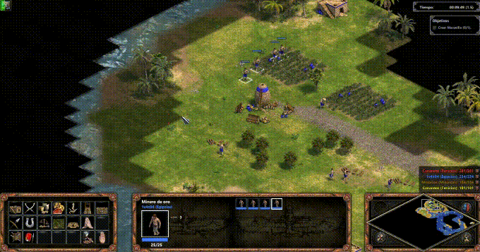
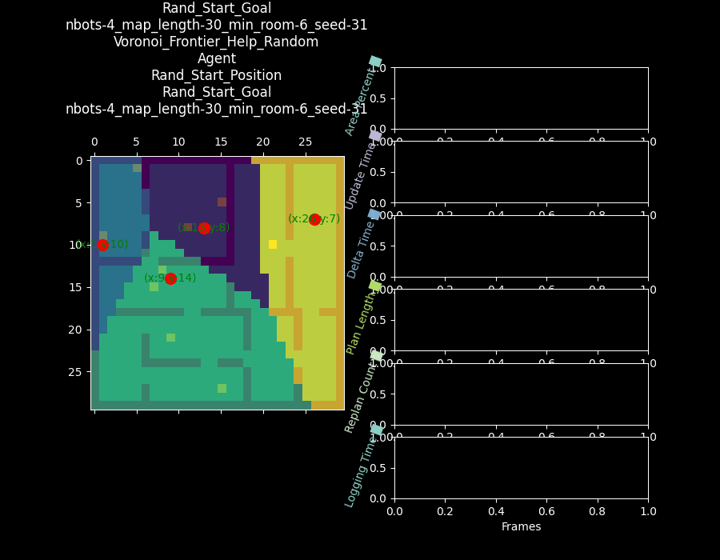
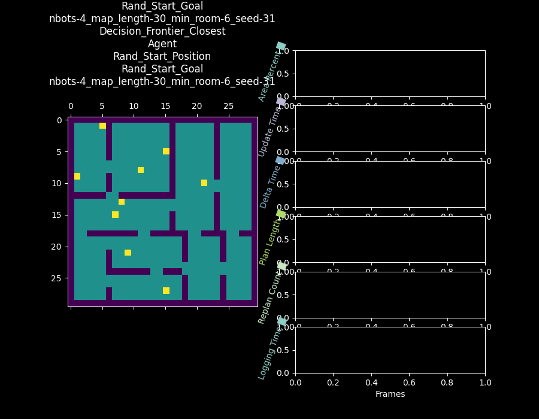
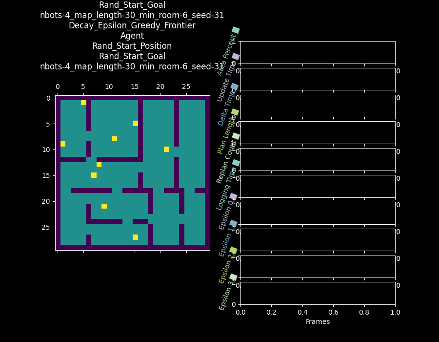
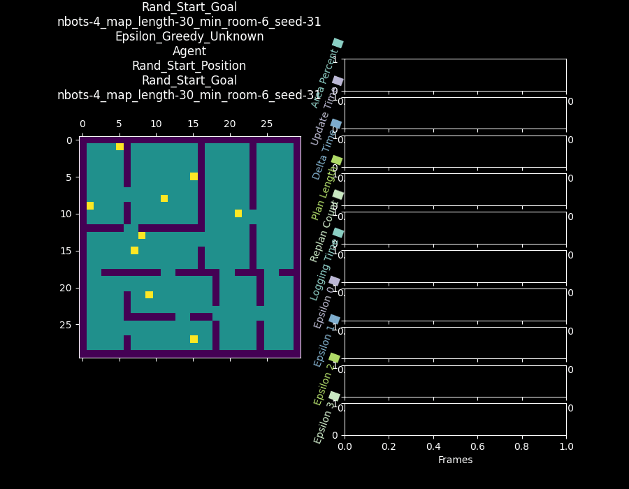
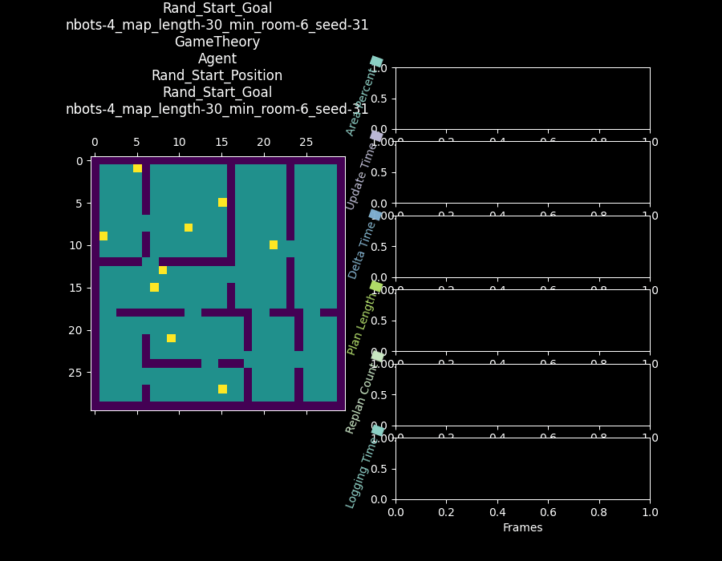
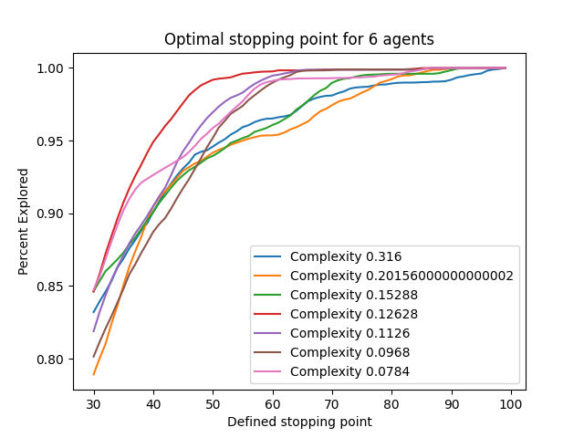

# Multi Agents Area Exploration

## Quick Summary



This project is investigating how to explore a building map that is not known prior except its boundary. To analyze the efficiencies between different approaches for exploration time, we compare various methods as well as different starting and goal conditions. We assume perfect communication among agents is possible as well as each agent localize itself over the map.

Furthermore, we also examined how agent loss would affect the overall performance by placing mines over the ground.

Finally, we generated an optimal stopping condition to test how no communication among agents would affect overall exploration. The question we are trying to answer under this condition is as follows: Assuming there is no communication possible among agents, what percentage of the map should be explored by an individual agent so that full exploration is successfully accomplished.


## Installation of the Environment:

```
git clone https://github.com/DIRECTLab/Multi_Agents_Area_Exploration.git
cd Multi_Agents_Area_Exploration/
conda create -y --name multiagent python==3.9.2
conda activate multiagent
pip install \
	numpy==1.23.3 \
	opencv-python==4.6.0.66 \
    opencv-contrib-python==4.6.0.66 \
	pygame==2.3.0 \
	scipy==1.10.1 \
	jupyter_client==7.0.6 \
    jupyter_core==5.3.0 \
    numba==0.56.4 \
    pillow==9.2.0 \
    scikit-learn==1.2.2 \
    matplotlib==3.5.3 \
    pandas==1.4.4 \
    tqdm==4.64.1 \
    psutil==5.9.4
```

## Running the Program:

To run  the simulation, run the following command:
```
python main.py
```

If you would like to change the simulation parameters, you can do so by changing the values in the `parameters_cfg.py` file.


### Simulation Parameters:


| Parameter | Description | Default Value |
| --- | --- | --- |
| `Debug` | Debug mode, renders a GUI | `False` |
| `Use_process` | Use multiprocessing | `False` |
| `Create_gif` | Create gif, Debug must be True to run this | `False` |
| `agent_count_list` | List of agent counts to run the simulation with | `[2,4,6]` or `list(range(4,12,4))` |
| `iteration_repeat_experiment` | Number of times to repeat the experiment | `1` or `list(range(0, 60))` |
| `min_rom_size` | Minimum size of the room | `30` or `list( range(4,10,2))` |
| `Method_list` | A list of all the Methods that the simulation will run, these all inherit from the base `Agent` class | - |
| `Start_scenario_list`| starting locations for all the agents | `Manual_Start`, `Rand_Start_Position`, `Edge_Start_Position`, `Top_Left_Start_Position`, `Center_Start_Position`,  |
| `Start_Goal_list`| Starting Goal Locations | `Manual_Goal`, `Rand_Start_Goal`, `Center_Start_Goal`, `Top_Left_Start_Goal`, `Edge_Start_Goal`,  `Distributed_Goal`, |
| `Robot_Loss`| Holds A list of Classes that change the scenario, where `Agent`is a normal run, `Unrecoverable` the robots will hit random mines and become disabled, and last the `Disrepair` robots can help and fix other robots   | `[Agent, Unrecoverable, Disrepair]` |


| Method | Description |
| --- | --- |
| `Frontier_Random` | Each agent randomly selects a frontier section of the map to explore. ||
| `Frontier_Closest` | Each agent selects the closest frontier section of the map to explore. ||
| `Unknown_Random` | Each agent randomly selects an unknown section of the map to explore. ||
| `Unknown_Closest` | Each agent selects the closest unknown section of the map to explore. ||
| `Voronoi_Frontier_Random` | The map is split up into various sections and then the frontier random method is used within each section. ||
| `Voronoi_Frontier_Closest` | The map is split up into various sections and then the frontier closest method is used within each section. ||
| `Voronoi_Frontier_Help_Closest` | The map is split up into various sections and then the frontier closest method is used in tandem with the paired searching strategy. ||
| `Voronoi_Frontier_Help_Random` | The map is split up into various sections and then the frontier random method is used in tandem with the paired searching strategy. ||
| `Decision_Frontier_Closest` | Each agent shares it's goal position in the mutual data set. As each agent sets a new goal position it checks to see if any other agent is already visiting that location. If not, it keeps that location. If it is already taken \|then the agent with the shortest path keeps that location and the other is assigned a new goal. |
| `DarpVorOnly` | Separates the map into areas that are roughly the same and assigns an area to each agent. ||
| `DarpMST` | Creates a hamiltonian loop that helps each agent avoid covering the same location twice. This optimizes the number of spaces visited by each agent resulting in nearly the same amount of visited locations per agent. ||
| `Decay_Epsilon_Greedy_Unknown` | Each agent is assigned to either random or closest exploration of a frontier based on an epsilon value. As the simulation progresses the epsilon value decays resulting in less exploration as the map is explored more. ||
| `Decay_Epsilon_Greedy_Frontier` | Each agent is assigned to either random or closest exploration of an unknown area based on an epsilon value. As the simulation progresses the epsilon value decays resulting in less exploration as the map is explored more.||
| `Epsilon_Greedy_Unknown` | Each agent is assigned to either random or closest exploration of an unknown area based on a constant epsilon value. ||
| `Epsilon_Greedy_Frontier` | Each agent is assigned to either random or closest exploration of a frontier based on a constant epsilon value. ||
| `GameTheory` | This builds upon the heterogeneous method by allowing each agent to choose the anti-majority of search methods chosen by the other agents. The two options are random or closest. ||
| `Heterogeneous` | Each agent is able to view information about the other agents to choose a search method that is best for itself. ||


# Optimal Stopping

The code for the optimal stopping is found on the branch NoSharedMap. 

This section of the project implemented an optimal stopping algorithm to see how much of the map each individual agent 
would need to explore before the map is completely searched.
 
The algorithm is as follows:

- The agents have no communication ability, meaning they no longer know where other agents have explored
- The agents are randomly placed throughout the map and explore the closest frontier
- The agents each individually explore a predefined percentage of the map and stop once they have achieved their predetermined coverage
    - Once all agents are done, the total area coverage between all bots is computed

This allows us to see at what point the agents can stop exploring because they have collectively explored the entire region. This delves into an area of unexplored robotics where we can optimize exploration tasks where there is no or minimal communication. 

Future implementations will include larger map sizes, more agents, different exploration algorithms, and partial communication. We hope to see the impact of these various parameters on the agents' ability to explore.

With the vanilla results that we have already compiled we have seen that the total explored area is invariant of the complexity. The primary factor in determining the convergence ability of the exploration is the number of agents. With 6 agents and a square map of 50 units, each bot needed to explore around 60% of the total area to achieve full area coverage. 

We also saw that the maps with a medium complexity tend to converge faster than maps with high or low complexity. For example, with 6 bots and a complexity rating of .12628 the bots converged on 100% after only individually exploring approximately 45%.

The graphs for all this data can be found on the branch under the folder optimal_stopping_graphs/

<!-- import a image form assets -->

